GPU Ray Tracing in One Weekend by Unity 2019.3
==============================================

Version 1.0, 2019-Oct-23
<br/>
Copyright 2019. ZHing. All rights received.
<br/>

目录：
- [GPU Ray Tracing in One Weekend by Unity 2019.3](#gpu-ray-tracing-in-one-weekend-by-unity-20193)
- [1. 综述](#1-%e7%bb%bc%e8%bf%b0)
  - [1.1. 准备工作环境](#11-%e5%87%86%e5%a4%87%e5%b7%a5%e4%bd%9c%e7%8e%af%e5%a2%83)
  - [1.2. 利用SPR调用DXR](#12-%e5%88%a9%e7%94%a8spr%e8%b0%83%e7%94%a8dxr)
  - [1.3. 本文所使用SRP框架介绍](#13-%e6%9c%ac%e6%96%87%e6%89%80%e4%bd%bf%e7%94%a8srp%e6%a1%86%e6%9e%b6%e4%bb%8b%e7%bb%8d)
- [2. 输出图像](#2-%e8%be%93%e5%87%ba%e5%9b%be%e5%83%8f)
  - [2.1. 在Unity中创建RayTraceShader](#21-%e5%9c%a8unity%e4%b8%ad%e5%88%9b%e5%bb%baraytraceshader)
  - [2.2. C#中在SRP管线。](#22-c%e4%b8%ad%e5%9c%a8srp%e7%ae%a1%e7%ba%bf)
  - [2.3. 最终输出](#23-%e6%9c%80%e7%bb%88%e8%be%93%e5%87%ba)
- [3. 输出背景](#3-%e8%be%93%e5%87%ba%e8%83%8c%e6%99%af)
  - [3.1. 在Unity中创建RayTraceShader](#31-%e5%9c%a8unity%e4%b8%ad%e5%88%9b%e5%bb%baraytraceshader)
  - [3.2. C#代码](#32-c%e4%bb%a3%e7%a0%81)
  - [3.3. 最终输出](#33-%e6%9c%80%e7%bb%88%e8%be%93%e5%87%ba)
- [4. 渲染Sphere](#4-%e6%b8%b2%e6%9f%93sphere)
  - [4.1. 在Unity中创建RayTraceShader](#41-%e5%9c%a8unity%e4%b8%ad%e5%88%9b%e5%bb%baraytraceshader)
  - [4.2. 创建球体Shader](#42-%e5%88%9b%e5%bb%ba%e7%90%83%e4%bd%93shader)
  - [4.3. C#代码](#43-c%e4%bb%a3%e7%a0%81)
  - [4.4. 最终输出](#44-%e6%9c%80%e7%bb%88%e8%be%93%e5%87%ba)
- [5. 法线输出](#5-%e6%b3%95%e7%ba%bf%e8%be%93%e5%87%ba)
  - [5.1. 创建球体Shader](#51-%e5%88%9b%e5%bb%ba%e7%90%83%e4%bd%93shader)
  - [5.2. 最终输出](#52-%e6%9c%80%e7%bb%88%e8%be%93%e5%87%ba)
- [6. Antialiasing](#6-antialiasing)
  - [6.1. 在Unity中创建RayTraceShader](#61-%e5%9c%a8unity%e4%b8%ad%e5%88%9b%e5%bb%baraytraceshader)
  - [6.2. C#代码](#62-c%e4%bb%a3%e7%a0%81)
  - [6.3. 最终输出](#63-%e6%9c%80%e7%bb%88%e8%be%93%e5%87%ba)
- [7. Diffuse材质](#7-diffuse%e6%9d%90%e8%b4%a8)
  - [7.1. RayTrace Shader](#71-raytrace-shader)
  - [7.2. 创建物体Shader及其Material](#72-%e5%88%9b%e5%bb%ba%e7%89%a9%e4%bd%93shader%e5%8f%8a%e5%85%b6material)
  - [7.3. 最终输出](#73-%e6%9c%80%e7%bb%88%e8%be%93%e5%87%ba)
- [8. Dielectrics材质](#8-dielectrics%e6%9d%90%e8%b4%a8)
  - [8.1. 物体ClosestHitShader](#81-%e7%89%a9%e4%bd%93closesthitshader)
  - [8.2. 最终输出](#82-%e6%9c%80%e7%bb%88%e8%be%93%e5%87%ba)
- [9. 失焦模糊](#9-%e5%a4%b1%e7%84%a6%e6%a8%a1%e7%b3%8a)
  - [9.1. C#代码](#91-c%e4%bb%a3%e7%a0%81)
  - [9.2. RayTrace Shader](#92-raytrace-shader)
  - [9.3. 最终输出](#93-%e6%9c%80%e7%bb%88%e8%be%93%e5%87%ba)
- [10. 全部放到一起](#10-%e5%85%a8%e9%83%a8%e6%94%be%e5%88%b0%e4%b8%80%e8%b5%b7)

# 1. 综述
本文基于 [https://raytracing.github.io]() 的《Ray Tracing in One Weekend》，介绍如何使用Unity 2019.3、SRP和DXR实现Ray Tracing。
因此在阅读本文之前，需要首先阅读《Ray Tracing in One Weekend》。本文不会对《Ray Tracing in One Weekend》文中已经解释清楚的算法做重复解释。本文中提到的“原文”均指“Ray Tracing in One Weekend”。

本文的重点放在如何在Unity 2019.3中实现同原文一样的Ray Tracing渲染。

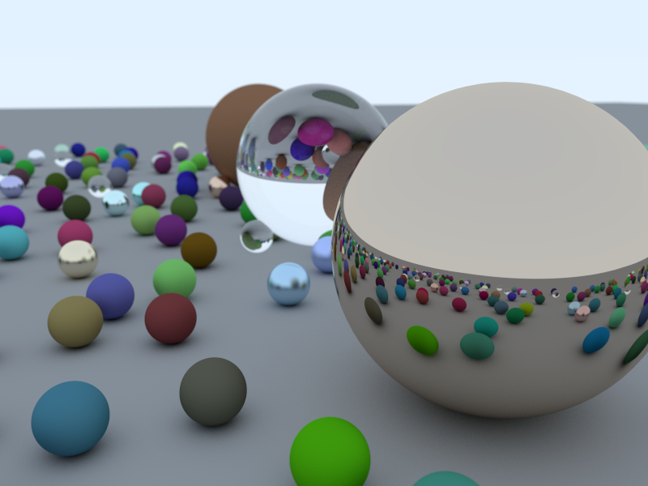

由于使用了基于GPU加速的DXR，因此本文的所有案例渲染速度比原文要快得多得多，但前提需要支持DXR的硬件和系统来运行。

此外由于目前Unity 2019.3目前集成的DXR并不支持‎Intersection Shader，因此无法想原文中一样使用Procedural Geometry，将使用Mesh代替。

## 1.1. 准备工作环境
本文所述实现，基于Unity 2019.3集成的DXR。因此需要对Unity工程进行基本的设置。

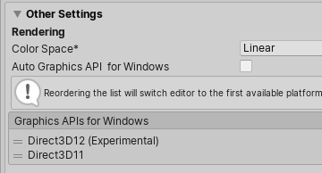

设置Graphics API为Direct3D12为第一项

## 1.2. 利用SPR调用DXR
因为使用了SPR和SIMD数学库，因此需要至少导入如下Unity Package。

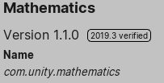


## 1.3. 本文所使用SRP框架介绍
本文所有例程都基于一个最简SRP框架实习，详细请参看工程源代码，这里只做简单介绍。

**RayTracingRenderPipelineAsset**继承自RenderPipelineAsset，SRP的核心类，用于创建RayTracingRenderPipeline。

**RayTracingRenderPipeline**继承自RenderPipeline，SRP的核心类。Render函数为整个渲染流程的入口。

**RayTracingTutorialAsset**为各个例程资源的基类。继承自ScriptableObject，保存了各个例程所需要用到的Shader引用。

**RayTracingTutorial**为各个例程的基类。由RayTracingRenderPipeline驱动进行各个例程的渲染工作。

# 2. 输出图像
例程类：OutputColorTutorial

场景文件：1_OutputColorTutorialScene

利用Ray Tracing输出图像，可谓Ray Tracing中的Hello World。

## 2.1. 在Unity中创建RayTraceShader
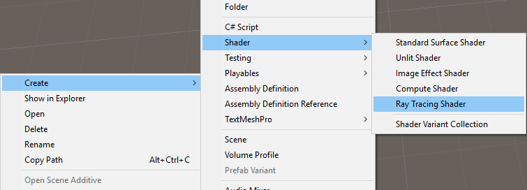
```glsl
#pragma max_recursion_depth 1

RWTexture2D<float4> _OutputTarget;

[shader("raygeneration")]
void OutputColorRayGenShader()
{
  uint2 dispatchIdx = DispatchRaysIndex().xy;
  uint2 dispatchDim = DispatchRaysDimensions().xy;

  _OutputTarget[dispatchIdx] = float4((float)dispatchIdx.x / dispatchDim.x, (float)dispatchIdx.y / dispatchDim.y, 0.2f, 1.0f);
}
```
**DispatchRaysIndex().xy**用于返回当前像素的位置

**DispatchRaysDimensions().xy**用于返回当前渲染目标的尺寸

以上代码功能为从左到右将像素的R通道从0到1变化，从下到上将像素的G通道从0到1变化，所有像素的B通道保持0.2不变。

## 2.2. C#中在SRP管线。
```csharp
var outputTarget = RequireOutputTarget(camera);

var cmd = CommandBufferPool.Get(typeof(OutputColorTutorial).Name);
try
{
  using (new ProfilingSample(cmd, "RayTracing"))
  {
    cmd.SetRayTracingTextureParam(_shader, _outputTargetShaderId, outputTarget);
    cmd.DispatchRays(_shader, "OutputColorRayGenShader", (uint) outputTarget.rt.width, (uint) outputTarget.rt.height, 1, camera);
  }
  context.ExecuteCommandBuffer(cmd);

  using (new ProfilingSample(cmd, "FinalBlit"))
  {
    cmd.Blit(outputTarget, BuiltinRenderTextureType.CameraTarget, Vector2.one, Vector2.zero);
  }
  context.ExecuteCommandBuffer(cmd);
}
finally
{
  CommandBufferPool.Release(cmd);
}
```
**RequireOutputTarget**函数根据当前将要渲染的相机设置获取对应的渲染目标。详细实现参看本文所附工程源代码。

**cmd.SetRayTracingTextureParam**用于将渲染目标设置到以上RayTrace Shader中。_shader为Tracing Shader对象。

参数*_outputTargetShaderId*通过Shader.PropertyToID("_OutputTarget")方式得到，本文后续都通过此方法获取将不再赘述。

**cmd.DispatchRays**用于调用之前RayTrace Shader中的raygeneration函数OutputColorRayGenShader进行Ray Tracing。

由于RayTrace Shader只能渲染到RenderTarget上，在屏幕上并看不到渲染结果，因此最后需要进行一次Blit操作将渲染结果绘制到屏幕上。后续渲染都有此步骤将不再赘述。

## 2.3. 最终输出
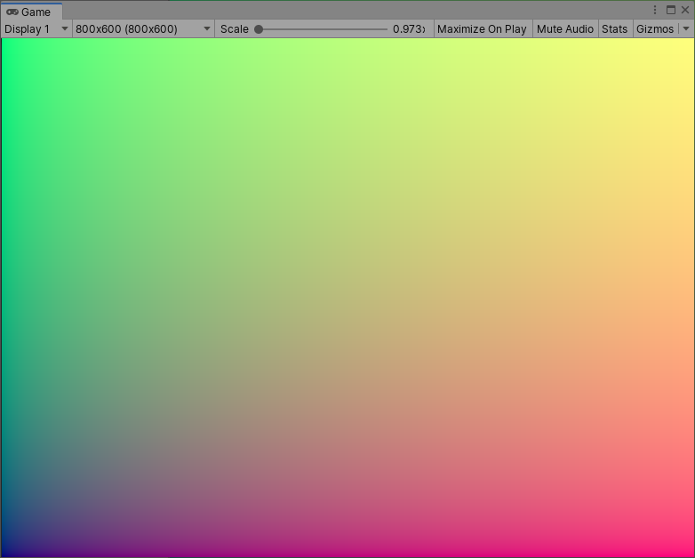

# 3. 输出背景
例程类：BackgroundTutorial

场景文件：2_BackgroundTutorialScene

利用Ray Tracing输出渐变背景

## 3.1. 在Unity中创建RayTraceShader
```glsl
inline void GenerateCameraRay(out float3 origin, out float3 direction)
{
  // center in the middle of the pixel.
  float2 xy = DispatchRaysIndex().xy + 0.5f;
  float2 screenPos = xy / DispatchRaysDimensions().xy * 2.0f - 1.0f;

  // Un project the pixel coordinate into a ray.
  float4 world = mul(_InvCameraViewProj, float4(screenPos, 0, 1));

  world.xyz /= world.w;
  origin = _WorldSpaceCameraPos.xyz;
  direction = normalize(world.xyz - origin);
}

inline float3 Color(float3 origin, float3 direction)
{
  float t = 0.5f * (direction.y + 1.0f);
  return (1.0f - t) * float3(1.0f, 1.0f, 1.0f) + t * float3(0.5f, 0.7f, 1.0f);
}

[shader("raygeneration")]
void BackgroundRayGenShader()
{
  const uint2 dispatchIdx = DispatchRaysIndex().xy;

  float3 origin;
  float3 direction;
  GenerateCameraRay(origin, direction);

  _OutputTarget[dispatchIdx] = float4(Color(origin, direction), 1.0f);
}
```
**GenerateCameraRay**用于在当前像素位置构建一条光线的Origin和Direction，此处和原文稍有不同。

首先计算出屏幕坐标在Project Space中的位置*screenPos*。然后利用C#中计算好的_InvCameraViewProj矩阵将其变换到World Space从而获得光线方向*direction*。*origin*直接通过C#中传入的_WorldSpaceCameraPos获得。

**Color**函数和原文一致，用于计算从上到下的渐变。

## 3.2. C#代码

C#中设置相机参数
```csharp
Shader.SetGlobalVector(CameraShaderParams._WorldSpaceCameraPos, camera.transform.position);
var projMatrix = GL.GetGPUProjectionMatrix(camera.projectionMatrix, false);
var viewMatrix = camera.worldToCameraMatrix;
var viewProjMatrix = projMatrix * viewMatrix;
var invViewProjMatrix = Matrix4x4.Inverse(viewProjMatrix);
Shader.SetGlobalMatrix(CameraShaderParams._InvCameraViewProj, invViewProjMatrix);
```
设置_WorldSpaceCameraPos和_InvCameraViewProj。

C#中在SRP管线中的代码如下。
```csharp
var outputTarget = RequireOutputTarget(camera);

var cmd = CommandBufferPool.Get(typeof(OutputColorTutorial).Name);
try
{
  using (new ProfilingSample(cmd, "RayTracing"))
  {
    cmd.SetRayTracingTextureParam(_shader, _outputTargetShaderId, outputTarget);
    cmd.DispatchRays(_shader, "BackgroundRayGenShader", (uint) outputTarget.rt.width, (uint) outputTarget.rt.height, 1, camera);
  }
  context.ExecuteCommandBuffer(cmd);

  using (new ProfilingSample(cmd, "FinalBlit"))
  {
    cmd.Blit(outputTarget, BuiltinRenderTextureType.CameraTarget, Vector2.one, Vector2.zero);
  }
  context.ExecuteCommandBuffer(cmd);
}
finally
{
  CommandBufferPool.Release(cmd);
}
```
此处和之前不同之处仅仅为调用RayTrace Shader不同。

## 3.3. 最终输出


# 4. 渲染Sphere
例程类：AddASphereTutorial

场景文件：3_AddASphereTutorialScene

利用Ray Tracing绘制一个球体。注意，由于Unity目前集成的DXR并不支持‎Intersection Shader，因此无法像原文中一样使用Procedural Geometry。改用一个球体Mesh进行绘制，对应FBX文件已放入源代码项目中。

## 4.1. 在Unity中创建RayTraceShader
```glsl
struct RayIntersection
{
  float4 color;
};

inline float3 BackgroundColor(float3 origin, float3 direction)
{
  float t = 0.5f * (direction.y + 1.0f);
  return (1.0f - t) * float3(1.0f, 1.0f, 1.0f) + t * float3(0.5f, 0.7f, 1.0f);
}

[shader("raygeneration")]
void AddASphereRayGenShader()
{
  const uint2 dispatchIdx = DispatchRaysIndex().xy;

  float3 origin;
  float3 direction;
  GenerateCameraRay(origin, direction);

  RayDesc rayDescriptor;
  rayDescriptor.Origin = origin;
  rayDescriptor.Direction = direction;
  rayDescriptor.TMin = 1e-5f;
  rayDescriptor.TMax = _CameraFarDistance;

  RayIntersection rayIntersection;
  rayIntersection.color = float4(0.0f, 0.0f, 0.0f, 0.0f);

  TraceRay(_AccelerationStructure, RAY_FLAG_CULL_BACK_FACING_TRIANGLES, 0xFF, 0, 1, 0, rayDescriptor, rayIntersection);

  _OutputTarget[dispatchIdx] = rayIntersection.color;
}

[shader("miss")]
void MissShader(inout RayIntersection rayIntersection : SV_RayPayload)
{
  float3 origin = WorldRayOrigin();
  float3 direction = WorldRayDirection();
  rayIntersection.color = float4(BackgroundColor(origin, direction), 1.0f);
}
```
在raygeneration shader中调用了**TraceRay**函数发射光线，此函数的用法请参考[Microsoft DXR文档](https://microsoft.github.io/DirectX-Specs/d3d/Raytracing.html#hit-groups)。这里只解释一下**RayDesc**和**RayIntersection**结构，**RayDesc**为DXR中描述一条光线的数据结构，*Origin*为光线的起点，*Direction*为光线的方向，*TMin*为t的最小值，*TMax*为t的最大值（代码中为相机远裁剪面距离）。**Ray Intersection**结构为用户自定义的Ray Payload数据结构，用于在Ray Tracing过程中传递数据。此处定义的*color*用于返回Ray Trace的结果颜色。

此处增加了miss shader。miss shader将在没有任何光线碰撞被检测到时执行，此处调用*BackgroundColor*返回第3节中的渐变背景色。

## 4.2. 创建球体Shader
在Unity中创建一个普通的shader文件，在其末尾添加如下代码。
```glsh
SubShader
{
  Pass
  {
    Name "RayTracing"
    Tags { "LightMode" = "RayTracing" }

    HLSLPROGRAM

    #pragma raytracing test

    struct RayIntersection
    {
      float4 color;
    };

    CBUFFER_START(UnityPerMaterial)
    float4 _Color;
    CBUFFER_END

    [shader("closesthit")]
    void ClosestHitShader(inout RayIntersection rayIntersection : SV_RayPayload, AttributeData attributeData : SV_IntersectionAttributes)
    {
      rayIntersection.color = _Color;
    }

    ENDHLSL
  }
}
```
此处定义了另一个SubShader并在其中增加了一个名为RayTracing的Pass。Pass名字可以随意定义，后续C#中将会看到具体指定Pass的代码。

**#pragma raytracing test**表示这是一个Ray Trace Pass。

closesthit shader **ClosestHitShader**接收两个参数，第一个参数*rayIntersection*为之前传递的Ray Payload数据，第二个参数attributeData为发生碰撞的相关数据，本例并未使用，仅仅简单的返回一个颜色数据。注意：一个RayTracing Pass中有且只能有一个closesthit shader，Unity 2019.3目前并不支持多*hit group*。关于*hit group*参看[Microsoft DXR文档](https://microsoft.github.io/DirectX-Specs/d3d/Raytracing.html#hit-groups)。

创建好Shader后建立相应的Material，并在场景中创建一个球体附上相应的Material。

## 4.3. C#代码
C#中设置相机参数同第3节内容。

C#中在SRP管线中的代码如下。
```csharp
var outputTarget = RequireOutputTarget(camera);

var accelerationStructure = _pipeline.RequestAccelerationStructure();

var cmd = CommandBufferPool.Get(typeof(OutputColorTutorial).Name);
try
{
  using (new ProfilingSample(cmd, "RayTracing"))
  {
    cmd.SetRayTracingShaderPass(_shader, "RayTracing");
    cmd.SetRayTracingAccelerationStructure(_shader, _pipeline.accelerationStructureShaderId, accelerationStructure);
    cmd.SetRayTracingTextureParam(_shader, _outputTargetShaderId, outputTarget);
    cmd.DispatchRays(_shader, "AddASphereRayGenShader", (uint) outputTarget.rt.width, (uint) outputTarget.rt.height, 1, camera);
  }

  context.ExecuteCommandBuffer(cmd);

  using (new ProfilingSample(cmd, "FinalBlit"))
  {
    cmd.Blit(outputTarget, BuiltinRenderTextureType.CameraTarget, Vector2.one, Vector2.zero);
  }

  context.ExecuteCommandBuffer(cmd);
}
finally
{
  CommandBufferPool.Release(cmd);
}
```
本例中由于需要对球体进行Ray Trace检测，因此使用到了加速结构。**RequestAccelerationStructure**用于获取加速结构对象，通过**SetRayTracingAccelerationStructure**作为参数传递到Ray Trace Shader中。关于Unity中加速结构的使用，参看：[Unity Scripting API - RayTracingAccelerationStructure](https://docs.unity3d.com/2019.3/Documentation/ScriptReference/Experimental.Rendering.RayTracingAccelerationStructure.html)

**SetRayTracingShaderPass**用于设定当前Ray Tracing所需要执行的Pass，既4.2节中指定的*RayTracing Pass*。

## 4.4. 最终输出
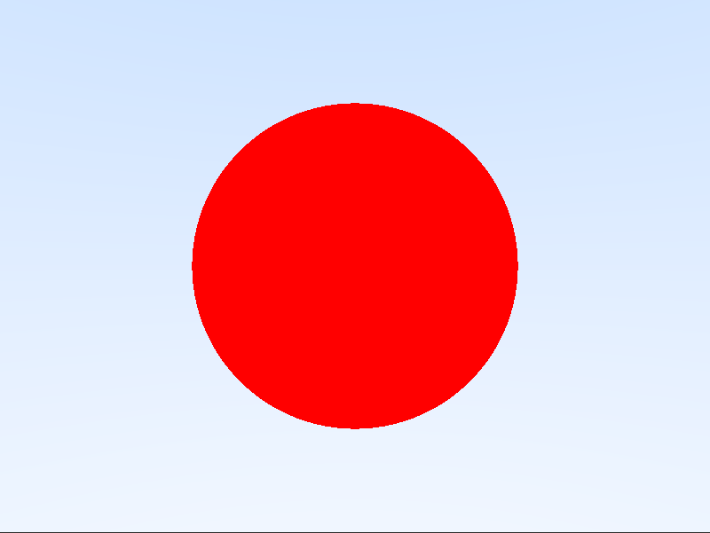

# 5. 法线输出
例程类：AddASphereTutorial

场景文件：4_SurfaceNormalTutorialScene

本例在第4节例程的基础上修改而来，仅仅修改了物体本身的Shader。

## 5.1. 创建球体Shader
```glsh
#include "UnityRaytracingMeshUtils.cginc"

struct RayIntersection
{
  float4 color;
};

struct IntersectionVertex
{
  // Object space normal of the vertex
  float3 normalOS;
};

void FetchIntersectionVertex(uint vertexIndex, out IntersectionVertex outVertex)
{
  outVertex.normalOS = UnityRayTracingFetchVertexAttribute3(vertexIndex, kVertexAttributeNormal);
}

[shader("closesthit")]
void ClosestHitShader(inout RayIntersection rayIntersection : SV_RayPayload, AttributeData attributeData : SV_IntersectionAttributes)
{
  // Fetch the indices of the currentr triangle
  uint3 triangleIndices = UnityRayTracingFetchTriangleIndices(PrimitiveIndex());

  // Fetch the 3 vertices
  IntersectionVertex v0, v1, v2;
  FetchIntersectionVertex(triangleIndices.x, v0);
  FetchIntersectionVertex(triangleIndices.y, v1);
  FetchIntersectionVertex(triangleIndices.z, v2);

  // Compute the full barycentric coordinates
  float3 barycentricCoordinates = float3(1.0 - attributeData.barycentrics.x - attributeData.barycentrics.y, attributeData.barycentrics.x, attributeData.barycentrics.y);

  float3 normalOS = INTERPOLATE_RAYTRACING_ATTRIBUTE(v0.normalOS, v1.normalOS, v2.normalOS, barycentricCoordinates);
  float3x3 objectToWorld = (float3x3)ObjectToWorld3x4();
  float3 normalWS = normalize(mul(objectToWorld, normalOS));

  rayIntersection.color = float4(0.5f * (normalWS + 1.0f), 0);
}
```
**UnityRayTracingFetchTriangleIndices**为Unity实现的Utils函数，用于根据*PrimitiveIndex*返回的索引信息获取Ray Tracing碰撞三角形的的索引值。

**IntersectionVertex**结构定义了我们所关心的Ray Tracing碰撞三角形的顶点信息。

**FetchIntersectionVertex**用于填充*IntersectionVertex*数据，其内部调用的*UnityRayTracingFetchVertexAttribute3*函数为Unity实现的Utils函数，用于获取对应的顶点数据。此例获取了Object Space的顶点Normal数据。

**INTERPOLATE_RAYTRACING_ATTRIBUTE**用于在碰撞三角形的三个顶点中插值计算出碰撞点的具体信息。

**ObjectToWorld3x4**为DXR builtin函数，用于将顶点数据从Object Space变换到World Space。

最后将最终得到的World Space中的*normalWS*输出到颜色。

## 5.2. 最终输出
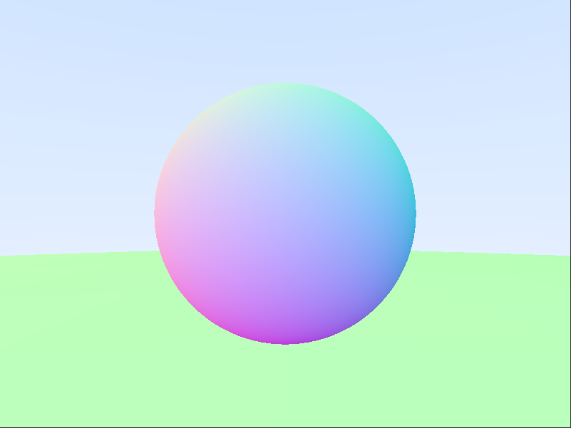

# 6. Antialiasing
例程类：AntialiasingTutorial

场景文件：5_AntialiasingTutorialScene

如果放大第5节中的最终输出图像会发现存在很严重的锯齿问题。


原文中处理此问题采用在一个像素内多次采样然后取平均值的方法，在DXR中如果使用同样方法将导致绘制一帧的时间大大增加，变得卡顿。因此在此例中使用Accumulate Average Sample的方法。

## 6.1. 在Unity中创建RayTraceShader
```glsl
struct RayIntersection
{
  uint4 PRNGStates;
  float4 color;
};

[shader("raygeneration")]
inline void GenerateCameraRayWithOffset(out float3 origin, out float3 direction, float2 offset)
{
  float2 xy = DispatchRaysIndex().xy + offset;
  float2 screenPos = xy / DispatchRaysDimensions().xy * 2.0f - 1.0f;

  // Un project the pixel coordinate into a ray.
  float4 world = mul(_InvCameraViewProj, float4(screenPos, 0, 1));

  world.xyz /= world.w;
  origin = _WorldSpaceCameraPos.xyz;
  direction = normalize(world.xyz - origin);
}

void AntialiasingRayGenShader()
{
  const uint2 dispatchIdx = DispatchRaysIndex().xy;
  const uint PRNGIndex = dispatchIdx.y * (int)_OutputTargetSize.x + dispatchIdx.x;
  uint4 PRNGStates = _PRNGStates[PRNGIndex];

  float4 finalColor = float4(0, 0, 0, 0);
  {
    float3 origin;
    float3 direction;
    float2 offset = float2(GetRandomValue(PRNGStates), GetRandomValue(PRNGStates));
    GenerateCameraRayWithOffset(origin, direction, offset);

    RayDesc rayDescriptor;
    rayDescriptor.Origin = origin;
    rayDescriptor.Direction = direction;
    rayDescriptor.TMin = 1e-5f;
    rayDescriptor.TMax = _CameraFarDistance;

    RayIntersection rayIntersection;
    rayIntersection.PRNGStates = PRNGStates;
    rayIntersection.color = float4(0.0f, 0.0f, 0.0f, 0.0f);

    TraceRay(_AccelerationStructure, RAY_FLAG_CULL_BACK_FACING_TRIANGLES, 0xFF, 0, 1, 0, rayDescriptor, rayIntersection);
    PRNGStates = rayIntersection.PRNGStates;
    finalColor += rayIntersection.color;
  }

  _PRNGStates[PRNGIndex] = PRNGStates;
  if (_FrameIndex > 1)
  {
    float a = 1.0f / (float)_FrameIndex;
    finalColor = _OutputTarget[dispatchIdx] * (1.0f - a) + finalColor * a;
  }

  _OutputTarget[dispatchIdx] = finalColor;
}
```
**GenerateCameraRayWithOffset**用于给该像素产生的光线做一个偏移操作，偏移值由*GetRandomValue*得到。

**GetRandomValue**获取随机数的方法采用了[《GPU Gems 3》](https://developer.nvidia.com/gpugems/GPUGems3/gpugems3_pref01.html)中“Chapter 37. Efficient Random Number Generation and Application Using CUDA”节的方法，具体实现可参看GPU Gems 3和本项目源代码。需要特别指出的是，GPU进行Ray Tracing时是多个像素并行计算的，因此随机数产生器的States需要每个像素相对独立。因此在*RayIntersection*数据结构中增加了*PRNGStates*用于保存随机数产生器的状态。C#中在*RayTracingRenderPipeline*中的*RequirePRNGStates*函数对其进行初始化，具体过程参看源代码。

**_FrameIndex**为当前渲染到第几帧的索引值，如果此值大于1则将当前帧的数据和之前的数据进行累加平均操作，否则直接将当前帧数据写入渲染目标中。

## 6.2. C#代码
```csharp
var outputTarget = RequireOutputTarget(camera);
var outputTargetSize = RequireOutputTargetSize(camera);

var accelerationStructure = _pipeline.RequestAccelerationStructure();
var PRNGStates = _pipeline.RequirePRNGStates(camera);

var cmd = CommandBufferPool.Get(typeof(OutputColorTutorial).Name);
try
{
  if (_frameIndex < 1000)
  {
    using (new ProfilingSample(cmd, "RayTracing"))
    {
      cmd.SetRayTracingShaderPass(_shader, "RayTracing");
      cmd.SetRayTracingAccelerationStructure(_shader, _pipeline.accelerationStructureShaderId,
        accelerationStructure);
      cmd.SetRayTracingIntParam(_shader, _frameIndexShaderId, _frameIndex);
      cmd.SetRayTracingBufferParam(_shader, _PRNGStatesShaderId, PRNGStates);
      cmd.SetRayTracingTextureParam(_shader, _outputTargetShaderId, outputTarget);
      cmd.SetRayTracingVectorParam(_shader, _outputTargetSizeShaderId, outputTargetSize);
      cmd.DispatchRays(_shader, "AntialiasingRayGenShader", (uint) outputTarget.rt.width,
        (uint) outputTarget.rt.height, 1, camera);
    }

    context.ExecuteCommandBuffer(cmd);
    if (camera.cameraType == CameraType.Game)
      _frameIndex++;
  }

  using (new ProfilingSample(cmd, "FinalBlit"))
  {
    cmd.Blit(outputTarget, BuiltinRenderTextureType.CameraTarget, Vector2.one, Vector2.zero);
  }

  context.ExecuteCommandBuffer(cmd);
}
finally
{
  CommandBufferPool.Release(cmd);
}
```
**RequireOutputTargetSize**用于获取当前渲染目标的大小。

**RequirePRNGStates**用于获取随机数生成器状态Buffer。

**_frameIndex**为当前渲染到第几帧的索引值，累积到1000后停止渲染。

## 6.3. 最终输出


# 7. Diffuse材质
例程类：AntialiasingTutorial

场景文件：6_DiffuseTutorialScene

关于Diffuse的实现参考原文。

## 7.1. RayTrace Shader
代码基本同前一节相同，区别在于Ray Payload增加了*remainingDepth*字段，标识当前光线还剩余几次递归可用，最大递归次数由MAX_DEPTH设定。注意：MAX_DEPTH值需要小于*max_recursion_depth*定义的值减1。
```glsl
RayIntersection rayIntersection;
rayIntersection.remainingDepth = MAX_DEPTH - 1;
rayIntersection.PRNGStates = PRNGStates;
rayIntersection.color = float4(0.0f, 0.0f, 0.0f, 0.0f);

TraceRay(_AccelerationStructure, RAY_FLAG_CULL_BACK_FACING_TRIANGLES, 0xFF, 0, 1, 0, rayDescriptor, rayIntersection);
PRNGStates = rayIntersection.PRNGStates;
finalColor += rayIntersection.color;
```

## 7.2. 创建物体Shader及其Material
ClosestHitShader代码如下
```glsl
[shader("closesthit")]
void ClosestHitShader(inout RayIntersection rayIntersection : SV_RayPayload, AttributeData attributeData : SV_IntersectionAttributes)
{
  // Fetch the indices of the currentr triangle
  // Fetch the 3 vertices
  // Compute the full barycentric coordinates
  // Get normal in world space.
  ...
  float3 normalWS = normalize(mul(objectToWorld, normalOS));

  float4 color = float4(0, 0, 0, 1);
  if (rayIntersection.remainingDepth > 0)
  {
    // Get position in world space.
    float3 origin = WorldRayOrigin();
    float3 direction = WorldRayDirection();
    float t = RayTCurrent();
    float3 positionWS = origin + direction * t;

    // Make reflection ray.
    RayDesc rayDescriptor;
    rayDescriptor.Origin = positionWS + 0.001f * normalWS;
    rayDescriptor.Direction = normalize(normalWS + GetRandomInUnitSphere(rayIntersection.PRNGStates));
    rayDescriptor.TMin = 1e-5f;
    rayDescriptor.TMax = _CameraFarDistance;

    // Tracing reflection.
    RayIntersection reflectionRayIntersection;
    reflectionRayIntersection.remainingDepth = rayIntersection.remainingDepth - 1;
    reflectionRayIntersection.PRNGStates = rayIntersection.PRNGStates;
    reflectionRayIntersection.color = float4(0.0f, 0.0f, 0.0f, 0.0f);

    TraceRay(_AccelerationStructure, RAY_FLAG_CULL_BACK_FACING_TRIANGLES, 0xFF, 0, 1, 0, rayDescriptor, reflectionRayIntersection);

    rayIntersection.PRNGStates = reflectionRayIntersection.PRNGStates;
    color = reflectionRayIntersection.color;
  }

  rayIntersection.color = _Color * 0.5f * color;
}
```
计算*normalWS*的方法和前一节相同，不再赘述。

当*rayIntersection.remainingDepth*大于0时将使用原文中的方法进行Diffuse计算，再次调用*TraceRay*进行Ray Tracing递归计算。

**GetRandomInUnitSphere**返回单位球体上均匀分布的随机向量。

## 7.3. 最终输出
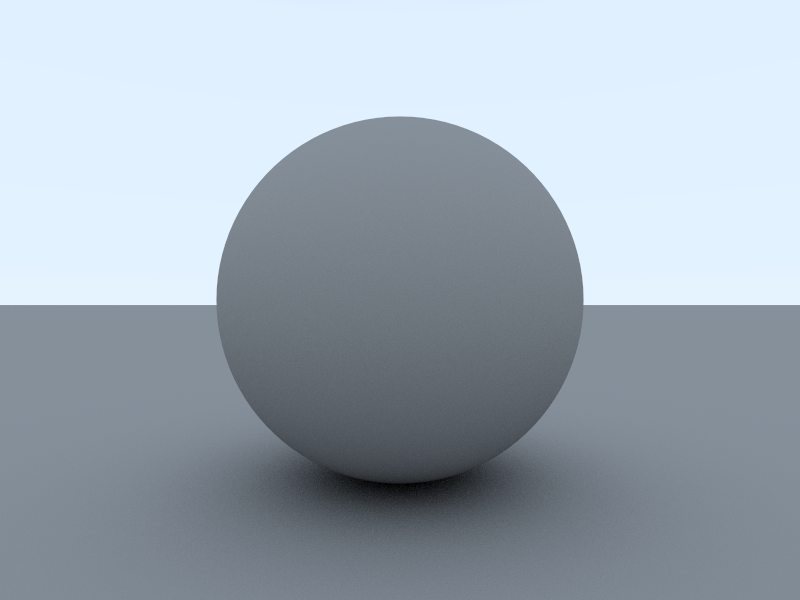

# 8. Dielectrics材质
例程类：AntialiasingTutorial

场景文件：8_DielectricsTutorialScene

原文中在使用负数半径的方法来达到玻璃泡的效果，由于Unity中我们无法使用Intersection Shader，因此里添加了一个新的物体Shader *DielectricsInv*来反转*Normal*达到相同的效果。

## 8.1. 物体ClosestHitShader
```glsl
inline float schlick(float cosine, float IOR)
{
  float r0 = (1.0f - IOR) / (1.0f + IOR);
  r0 = r0 * r0;
  return r0 + (1.0f - r0) * pow((1.0f - cosine), 5.0f);
}

[shader("closesthit")]
void ClosestHitShader(inout RayIntersection rayIntersection : SV_RayPayload, AttributeData attributeData : SV_IntersectionAttributes)
{
  // Fetch the indices of the currentr triangle
  // Fetch the 3 vertices
  // Compute the full barycentric coordinates
  // Get normal in world space.
  ...
  float3 normalWS = normalize(mul(objectToWorld, normalOS));

  float4 color = float4(0, 0, 0, 1);
  if (rayIntersection.remainingDepth > 0)
  {
    // Get position in world space.
    ...
    float3 positionWS = origin + direction * t;

    // Make reflection & refraction ray.
    float3 outwardNormal;
    float niOverNt;
    float reflectProb;
    float cosine;
    if (dot(-direction, normalWS) > 0.0f)
    {
      outwardNormal = normalWS;
      niOverNt = 1.0f / _IOR;
      cosine = _IOR * dot(-direction, normalWS);
    }
    else
    {
      outwardNormal = -normalWS;
      niOverNt = _IOR;
      cosine = -dot(-direction, normalWS);
    }
    reflectProb = schlick(cosine, _IOR);

    float3 scatteredDir;
    if (GetRandomValue(rayIntersection.PRNGStates) < reflectProb)
      scatteredDir = reflect(direction, normalWS);
    else
      scatteredDir = refract(direction, outwardNormal, niOverNt);

    RayDesc rayDescriptor;
    rayDescriptor.Origin = positionWS + 1e-5f * scatteredDir;
    rayDescriptor.Direction = scatteredDir;
    rayDescriptor.TMin = 1e-5f;
    rayDescriptor.TMax = _CameraFarDistance;

    // Tracing reflection or refraction.
    RayIntersection reflectionRayIntersection;
    reflectionRayIntersection.remainingDepth = rayIntersection.remainingDepth - 1;
    reflectionRayIntersection.PRNGStates = rayIntersection.PRNGStates;
    reflectionRayIntersection.color = float4(0.0f, 0.0f, 0.0f, 0.0f);

    TraceRay(_AccelerationStructure, RAY_FLAG_NONE, 0xFF, 0, 1, 0, rayDescriptor, reflectionRayIntersection);

    rayIntersection.PRNGStates = reflectionRayIntersection.PRNGStates;
    color = reflectionRayIntersection.color;
  }

  rayIntersection.color = _Color * color;
}
```
**_IOR**为材质的折射率。

和Diffuse的区别在于反射光线和折射光线的计算，具体算法参考原文，这里不再赘述。

此处调用TraceRay时将第二个参数改为了**RAY_FLAG_NONE**，因为光线射入物体内部后的折射光线需要与三角形反面做相交计算，故不再使用**RAY_FLAG_CULL_BACK_FACING_TRIANGLES**。

## 8.2. 最终输出
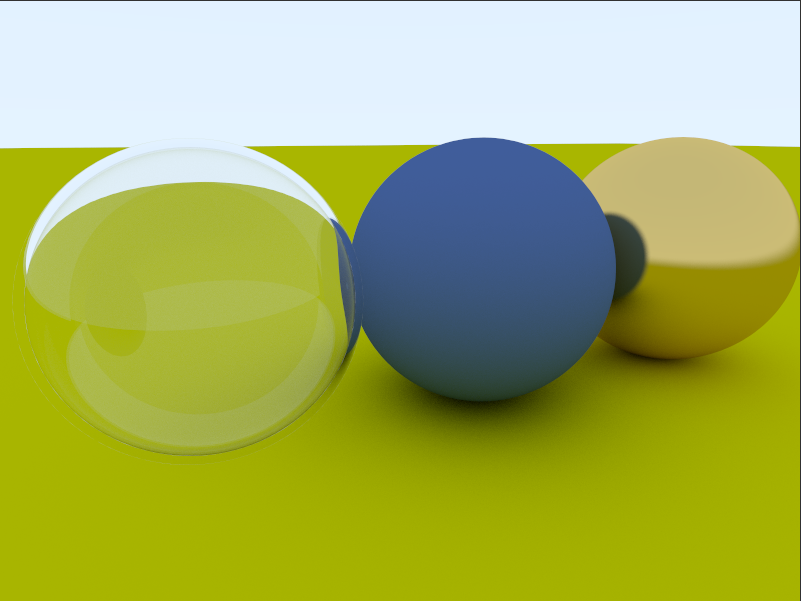

# 9. 失焦模糊

例程类：CameraTutorial

场景文件：9_CameraTutorialScene

算法原理参看原文，这里不再赘述。仅对DXR实现进行说明。

## 9.1. C#代码
**FocusCamera**类用于扩展Unity的Camera，为其增加了*focusDistance*和*aperture*参数。
```csharp
thisCamera = GetComponent<Camera>();
var theta = thisCamera.fieldOfView * Mathf.Deg2Rad;
var halfHeight = math.tan(theta * 0.5f);
var halfWidth = thisCamera.aspect * halfHeight;
leftBottomCorner = transform.position + transform.forward * focusDistance -
                   transform.right * focusDistance * halfWidth -
                   transform.up * focusDistance * halfHeight;
size = new Vector2(focusDistance * halfWidth * 2.0f, focusDistance * halfHeight * 2.0f);
```
**leftBottomCorner**为Camera的Film Plane的左下角的World Space坐标。

**size**为Camera的Film Plane在World Space中的大小。

```csharp
cmd.SetRayTracingVectorParam(_shader, FocusCameraShaderParams._FocusCameraLeftBottomCorner, focusCamera.leftBottomCorner);
cmd.SetRayTracingVectorParam(_shader, FocusCameraShaderParams._FocusCameraRight, focusCamera.transform.right);
cmd.SetRayTracingVectorParam(_shader, FocusCameraShaderParams._FocusCameraUp, focusCamera.transform.up);
cmd.SetRayTracingVectorParam(_shader, FocusCameraShaderParams._FocusCameraSize, focusCamera.size);
cmd.SetRayTracingFloatParam(_shader, FocusCameraShaderParams._FocusCameraHalfAperture, focusCamera.aperture * 0.5f);

cmd.SetRayTracingShaderPass(_shader, "RayTracing");
cmd.SetRayTracingAccelerationStructure(_shader, _pipeline.accelerationStructureShaderId,
  accelerationStructure);
cmd.SetRayTracingIntParam(_shader, _frameIndexShaderId, _frameIndex);
cmd.SetRayTracingBufferParam(_shader, _PRNGStatesShaderId, PRNGStates);
cmd.SetRayTracingTextureParam(_shader, _outputTargetShaderId, outputTarget);
cmd.SetRayTracingVectorParam(_shader, _outputTargetSizeShaderId, outputTargetSize);
cmd.DispatchRays(_shader, "CameraRayGenShader", (uint) outputTarget.rt.width,
  (uint) outputTarget.rt.height, 1, camera);
```
**_FocusCameraLeftBottomCorner**将Camera的Film Plane的左下角的World Space坐标传送到RayTrace Shader。

**_FocusCameraRight**, **_FocusCameraUp**将Camera在World Space中的右矢量和上适量传送到RayTrace Shader。

**_FocusCameraSize**将Camera的Film Plane在World Space中的大小传送到RayTrace Shader。

**_FocusCameraHalfAperture**将*Aperture*的一半传送到RayTrace Shader。

## 9.2. RayTrace Shader
RayTrace Shader基本同之前小节的内容，仅仅将*GenerateCameraRayWithOffset*替换为了*GenerateFocusCameraRayWithOffset*函数。
```glsl
inline void GenerateFocusCameraRayWithOffset(out float3 origin, out float3 direction, float2 apertureOffset, float2 offset)
{
  float2 xy = DispatchRaysIndex().xy + offset;
  float2 uv = xy / DispatchRaysDimensions().xy;

  float3 world = _FocusCameraLeftBottomCorner + uv.x * _FocusCameraSize.x * _FocusCameraRight + uv.y * _FocusCameraSize.y * _FocusCameraUp;
  origin = _WorldSpaceCameraPos.xyz + _FocusCameraHalfAperture * apertureOffset.x * _FocusCameraRight + _FocusCameraHalfAperture * apertureOffset.y * _FocusCameraUp;
  direction = normalize(world.xyz - origin);
}

float2 apertureOffset = GetRandomInUnitDisk(PRNGStates);
float2 offset = float2(GetRandomValue(PRNGStates), GetRandomValue(PRNGStates));
GenerateFocusCameraRayWithOffset(origin, direction, apertureOffset, offset);
```
算法原理同原文所述，只是部分计算移动到了C#阶段计算，参看9.1节代码。

**apertureOffset**由*GetRandomInUnitDisk*产生。

**GetRandomInUnitDisk**用于在单位圆上随机产生均匀分布的矢量。

## 9.3. 最终输出
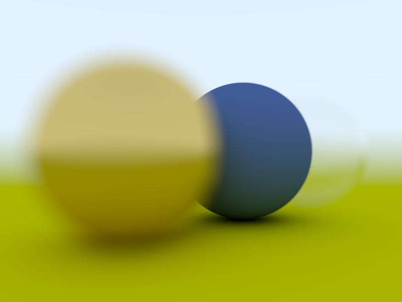

# 10. 全部放到一起

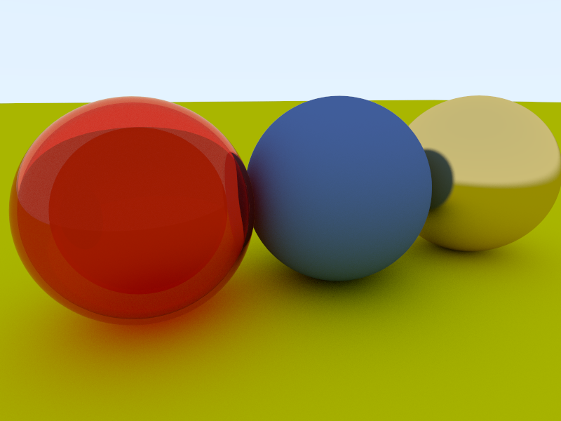
